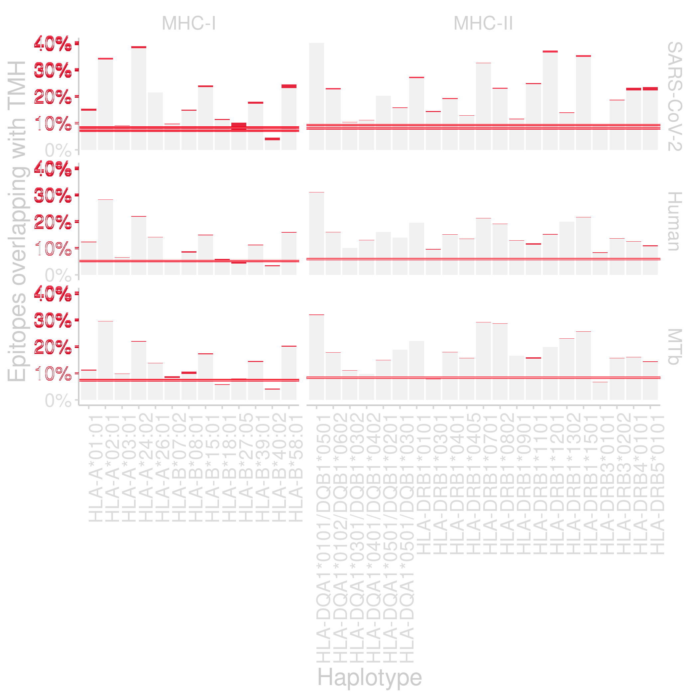

# bbbq_article

Branch   |[](https://github.com/richelbilderbeek/bbbq_article/actions)                                     
---------|--------------------------------------------------------------------------------------------------
`master` |[](https://github.com/richelbilderbeek/bbbq_article/actions/workflows/build_latex.yaml)
`develop`|[](https://github.com/richelbilderbeek/bbbq_article/actions/workflows/build_latex.yaml)

[](https://doi.org/10.5281/zenodo.5809139)

The article 'Transmembrane helices are an overlooked and evolutionarily conserved source of major histocompatibility complex class I and II epitopes',
by Bilderbeek, Baranov, van den Bogaart and Bianchi.

 * [This article on biorxiv](https://www.biorxiv.org/content/10.1101/2021.05.02.441235v3)

```
Bilderbeek, Richèl JC, et al. "Transmembrane helices are an overlooked and evolutionarily conserved source of major histocompatibility complex class I and II epitopes." bioRxiv (2021).
```

```
@article{bilderbeek2021transmembrane,
  title={Transmembrane helices are an overlooked and evolutionarily conserved source of major histocompatibility complex class {I} and {II} epitopes},
  author={Bilderbeek, Richèl JC and Baranov, Maxim and van den Bogaart, Geert and Bianchi, Frans},
  journal={bioRxiv},
  year={2021},
  publisher={Cold Spring Harbor Laboratory}
}
```

## Build the article

```
make
```

## Zip the article for Frontiers

```
make frontiers
```

Will create a file `~/frontiers.zip` 
with all files for a Frontiers submission.

## Figure sources

See [numbered_figure_files.csv](numbered_figure_files.csv) where the 
numbered figures (`figure_1a.tiff`, etc) originally come from.

The subfigures (e.g. figure 1a, figure 1b), 
were put into TIFF figure files (e.g. figure 1, figure 2) by @fransbianchi.

The figure TIFF files (e.g. figure_1.tiff, figure_2.tiff) were converted
to EPS files (e.g. figure_1.eps, figure_2.eps)
using [https://www.freeconvert.com/tiff-to-eps](https://www.freeconvert.com/tiff-to-eps).

## Re-do the analysis

### Naturally presented epitopes are derived from TMH

[](https://doi.org/10.5281/zenodo.5809109)

See [https://github.com/richelbilderbeek/bbbq_article_issue_157](https://github.com/richelbilderbeek/bbbq_article_issue_157).

### TMH-derived epitopes are over-presented

See [https://github.com/richelbilderbeek/bbbq_1_smart](https://github.com/richelbilderbeek/bbbq_1_smart).

[](https://doi.org/10.5281/zenodo.5809125)

### TMHs are conserved

See [https://github.com/richelbilderbeek/ncbi_peregrine](https://github.com/richelbilderbeek/ncbi_peregrine) for the scripts.

[](https://doi.org/10.5281/zenodo.5809128)

See [https://github.com/richelbilderbeek/ncbi_results](https://github.com/richelbilderbeek/ncbi_results) to see how the results are processed.

[](https://doi.org/10.5281/zenodo.5809134)

## Dependencies

Repository                                                                            |[](https://github.com/informalr/informalr/actions)                                                         
--------------------------------------------------------------------------------------|-------------------------------------------------------------------------------------------------------------------------
[`bbbq`](https://github.com/richelbilderbeek/bbbq)                                    |                   
[`bbbq_1_smart`](https://github.com/richelbilderbeek/bbbq_1_smart)                    |            
[`bbbq_article_issue_157`](https://github.com/richelbilderbeek/bbbq_article_issue_157)| 
[`ncbi_peregrine`](https://github.com/richelbilderbeek/ncbi_peregrine)                |         
[`ncbi_results`](https://github.com/richelbilderbeek/ncbi_results)                    |           


# How did you make the comparison figure?

I made the comparison figure using:

```
compare bbbq_1_smart_results/fig_f_tmh_2_panel.png bbbq_1_smart_2aa_results/fig_f_tmh_2_panel.png compare_fig_f_tmh_2_panel.png
```

The comparison figure:



## Labels

Fig|Label
---|-------------------------------------------
1A |`fig:bbbq_1_smart_results`
1B |`fig:hydrophobicity_1`
1C |`fig:hydrophobicity_2`
2  |`fig:elution`
2A |`fig:2a`
2B |`fig:2b`
3A |`fig:f_snps_found_and_expected`
3B |`fig:f_tmh_ncbi`
3C |`fig:conservation`
4A |`fig:f_snps_found_and_expected_per_spanner`
4B |`fig:conservation_per_spanner`
4C |`fig:f_tmh_ncbi_per_spanner`
S1 |`fig:bianch_et_al_2017_1a`
S2 |`fig:bilderbeek_et_al_2021_1a`
S3 |`fig:snp_rel_pos`
S4 |`fig:thm_presentation_correlation`
S5 |`fig:t_cells_present_tmh_derived_epitopes`
S6 |`fig:f_tmh_mhc1_normalized`
S7 |`fig:f_tmh_mhc2_normalized`
S8 |`fig:rel_presentation_per_haplotype`
S9 |`fig:rel_presentation`
S10|`fig:snps_per_gene_name_ncbi`
S11|`fig:snps_per_gene_name_processed`
S12|`fig:n_proteins_per_gene_name`
S13|`fig:fig_n_snps_per_tmp`
S14|`fig:fig_n_tmhs_per_protein`
S15|`fig:bbbq_1_smart_results_2aas`

Tab |Label
----|-------------------------------------------
ST1 |`tab:ic50_binders_mhc1`
ST2 |`tab:ic50_binders_mhc2`
ST3 |`tab:ncbi_counts_1`
ST4 |`tab:ncbi_counts_2`
ST5 |`tab:tmh_binders_mhc2`
ST6 |`tab:elution`
ST7 |`tab:tmh_binders_mhc1`
ST8 |`tab:haplotype_abbreviations`
ST9 |`table:software_used`
ST10|`tab:f_tmh`
ST11|`tab:snp_stats`
ST12|`tab:snp_stats_per_spanner_single`
ST13|`tab:snp_stats_per_spanner_multi`
ST14|`tab:tmh_binders_mhc2_2aas`
ST15|`tab:tmh_binders_mhc1_2aas`

## Frontiers files

frontiers.aux
frontiersFPHY.cls
frontiersHLTH.cls
frontiersinHLTH&FPHY.bst
frontiersinSCNS_ENG_HUMS.bst
frontiers.log
frontiers.out
frontiers.pdf
frontiersSCNS.cls
frontiers_SupplementaryMaterial.tex
frontiers_suppmat.cls
frontiers.tex
logo1.eps
logo1-eps-converted-to.pdf
logo2.eps
logos.eps
logos-eps-converted-to.pdf
PDF examples
stfloats.sty
test.bib
YM-logo.eps

