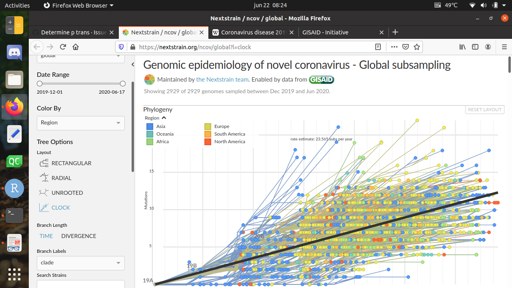
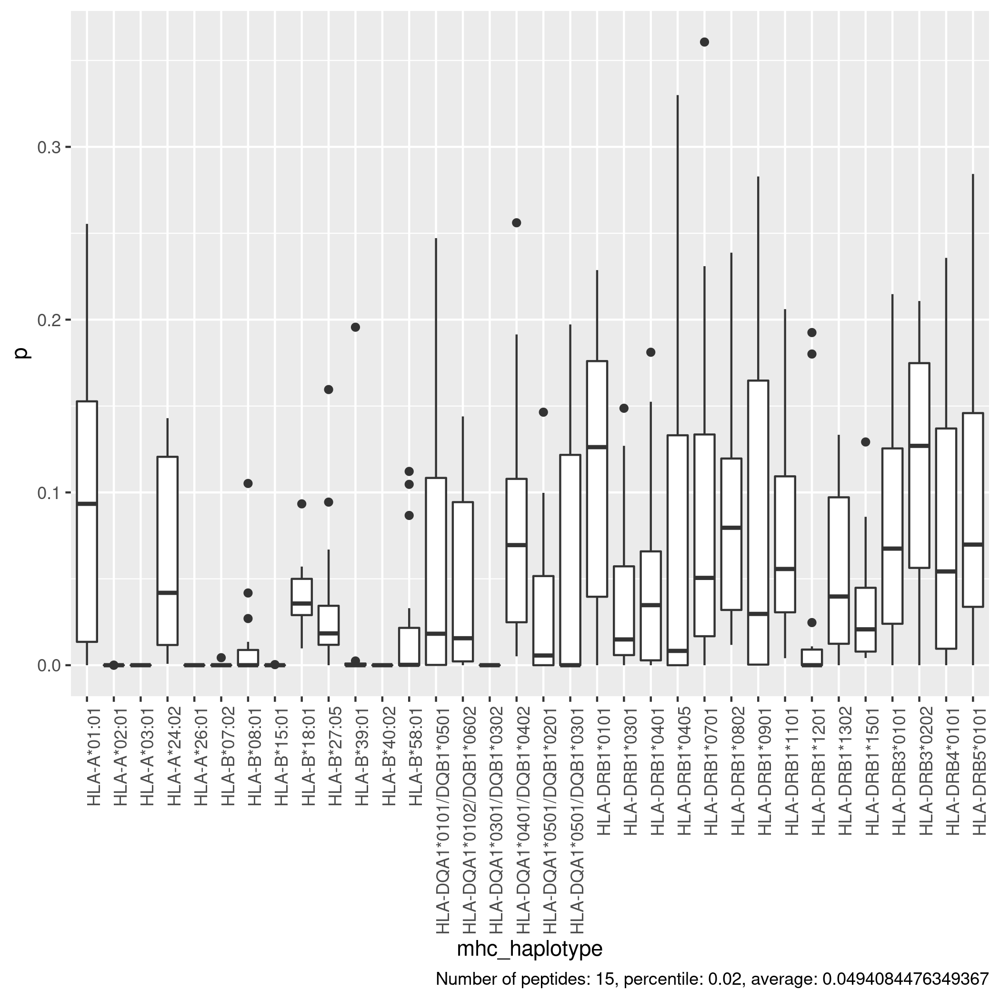

```{r setup, include=FALSE}
knitr::opts_chunk$set(echo = TRUE)
```

## Goal

To determine the strength of the COVID-19 dataset, using
a back-of-the-envelope calculation.

## Setup

We load the libraries needed:

```{r, message=FALSE}
library(testthat)
library(pureseqtmr)
```

PureseqTM, which predicts TMHs, must be installed:

```{r}
expect_true(is_pureseqtm_installed())
```

## Abbreviations

Abbr  |Full
------|-----------
AA    |Amino acid
AAs   |Amino acids
Abbr  |Abbreviation
TMH   |Transmembrane helix
TMHs  |Transmembrane helices

## Method

 * Obtain number of TMH AAs in proteome
 * Convert genomic evolution rate to proteomic mutation rate
 * Estimate the number of observed mutations that cause the pathogen
   to lose/acquire an epitope

### Obtain number of TMH AAs in proteome

We start from a Uniprot reference proteome: 

```{r}
fasta_filename <- "UP000464024.fasta"
expect_true(file.exists(fasta_filename))
```

We determine the topology:

```{r cache=TRUE}
topology <- pureseqtmr::predict_topology(fasta_filename)
n_proteins <- nrow(topology)
n_tmhs <- sum(tally_tmhs(topology)$n_tmhs)
n_non_tmh_aas <- sum(stringr::str_count(topology$topology, "0"))
n_tmh_aas <- sum(stringr::str_count(topology$topology, "1"))
n_aas <- n_non_tmh_aas + n_tmh_aas
f_aas <- n_tmh_aas / (n_tmh_aas + n_non_tmh_aas)
proteome_size <- n_aas
```

From the topology, we learn:

 * Proteome size: `r proteome_size` AAs
 * Proteins: there are `r n_proteins` proteins   
 * TMHs: there are `r n_tmhs` TMHs. 
   Fraction of proteome that is TMH is `r f_aas`
 * Amino acids: there are `r n_aas` AAs, 
   of which are `r n_tmh_aas` TMH AAs (and `r n_non_tmh_aas` non-TMH AAs)

### Convert genomic evolution rate to proteomic mutation rate

Get the proteome mutation rate, by converting it from the 
known DNA mutation rate.


```{r}
genome_size <- 29903
```

We know from `wu2020new` (`https://www.ncbi.nlm.nih.gov/genbank/sars-cov-2-seqs/`) 
that the reference genome size has `r genome_size` nucleotides.



```{r}
dna_evolution_rate_per_genome_per_year <- 23.565
```

We know from GISAID (also `bar2020sars`) that COVID-19 evolves 
with a rate of `r dna_evolution_rate_per_genome_per_year` mutations 
per genome per year.

```{r}
rel_size_proteome_to_genome <- proteome_size / genome_size
```

The relative size of the proteome compared to the genome is
`r rel_size_proteome_to_genome`, which is approximately one third,
as three nucleotides code for one AA.

```{r}
f_p_mut_synonymous <- 20 / 64
```

The fraction of DNA mutations that does change the AA 
is `r f_p_mut_synonymous`, estimated by taking the number of AAs per
possible DNA triplet combinations.

```{r}
aa_evolution_rate_per_genome_per_year <- 
  dna_evolution_rate_per_genome_per_year * f_p_mut_synonymous *
  rel_size_proteome_to_genome
```

The proteomic evolution rate per proteome per year is then
`r aa_evolution_rate_per_genome_per_year` amino acids per proteome per year.

```{r}
tmh_aa_evolution_rate_per_genome_per_year <- 
  aa_evolution_rate_per_genome_per_year * f_aas
```

Because only `r f_aas` of all AAs is part of a TMH,
we expect `r tmh_aa_evolution_rate_per_genome_per_year` TMH AAs
changed per year.

```{r}
years_per_pandemic <- 0.5
```

The first COVID-19 sequence (`https://www.ncbi.nlm.nih.gov/nuccore/NC_045512`)
was created in December 2019. Currenly, June 2020, 
is `r years_per_pandemic` years later.

```{r}
f_avg_time_per_sequence <- 0.5
```

The COVID-19 sequences are obtained during that time, 
instead of being collected today. Due to this, less mutations
will be visible. Due to this, we assume that on average, sequences
are collected halfway the pandemic, having a proportion of
`r f_avg_time_per_sequence` of the mutation information.

```{r}
tmh_aa_evolution_rate_per_sequence <-
  tmh_aa_evolution_rate_per_genome_per_year *
  years_per_pandemic *
  f_avg_time_per_sequence
```

Due to this, per proteome sequence, we 
expect to observe `r tmh_aa_evolution_rate_per_sequence`
TMH AA mutations per sequence.


```{r}
n_sequences <- 49790
```

There are `r n_sequences` COVID-19 sequences (`https://www.gisaid.org/`).


```{r}
n_tmh_aa_mutations <- tmh_aa_evolution_rate_per_sequence * n_sequences
```

Therefore, for the complete data set, we expect to 
find `r n_tmh_aa_mutations` AA mutations in TMHs. 

##  Estimate the number of state transitions

For the complete data set, we expect to 
find `r n_tmh_aa_mutations` AA mutations in TMHs.

Not all mutations, however, will cause the pathogen to lose or acquire
an epitope.



> This plot shows the chance of a state transition `p`,
> per haplotype, based on simulated data

```{r}
p_state_transition <- 0.0494
```

Based upon simulations (see https://github.com/richelbilderbeek/bbbq_p_trans), we 
estimated this chance at `p_state_transition`:

```{r}
n_state_transitions <- p_state_transition * n_tmh_aa_mutations
```

So, for the full COVID-19 dataset, we expect to 
find `r n_state_transitions` state transitions.

## Conclusion

```{r}
draw_conclusion <- function(n_state_transitions) {
  if (n_state_transitions < 1) return("useless")
  if (n_state_transitions < 10) return("weak")
  if (n_state_transitions < 20) return("fine")
  if (n_state_transitions < 30) return("okay")
  if (n_state_transitions < 50) return("good")
  if (n_state_transitions < 100) return("great")
  "awesome"
}
```

Based on the expected number of transitions, `r n_state_transitions`, we draw a conslusion.

```{r}
conclusion <- draw_conclusion(n_state_transitions)
```

We conclude that for our expected `r n_state_transitions` state
transitions, that the dataset is `r conclusion`.
